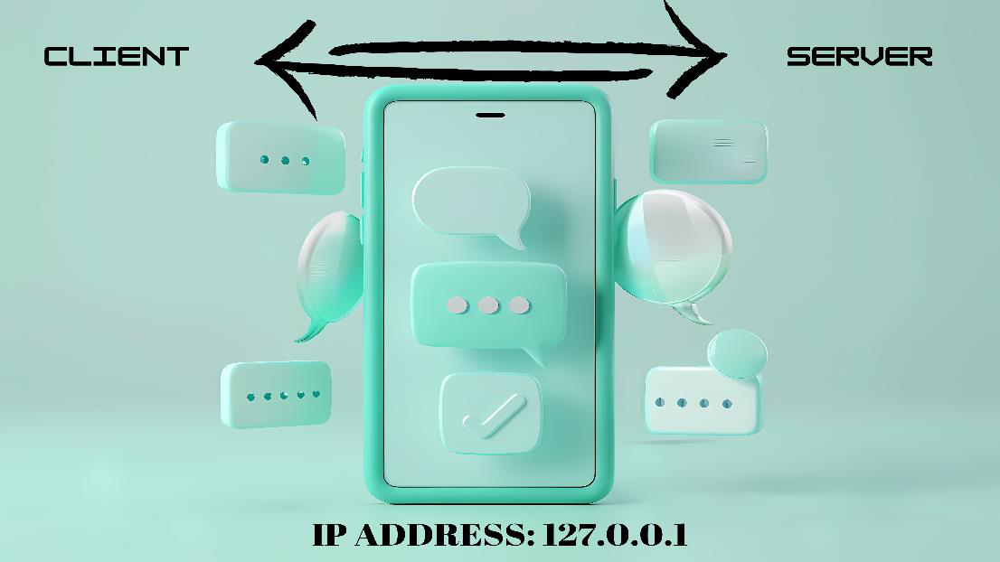
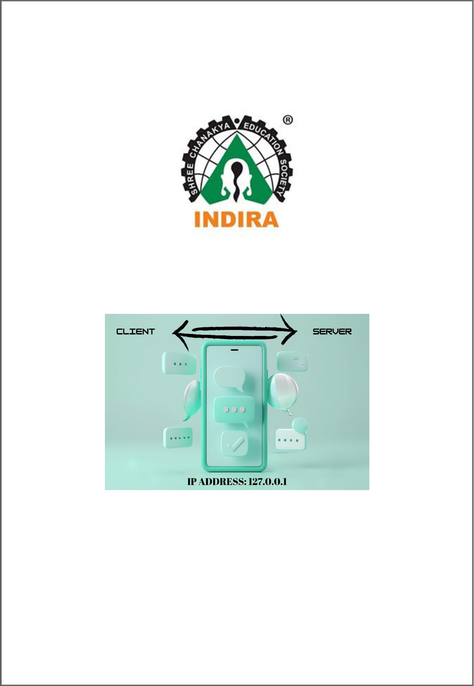
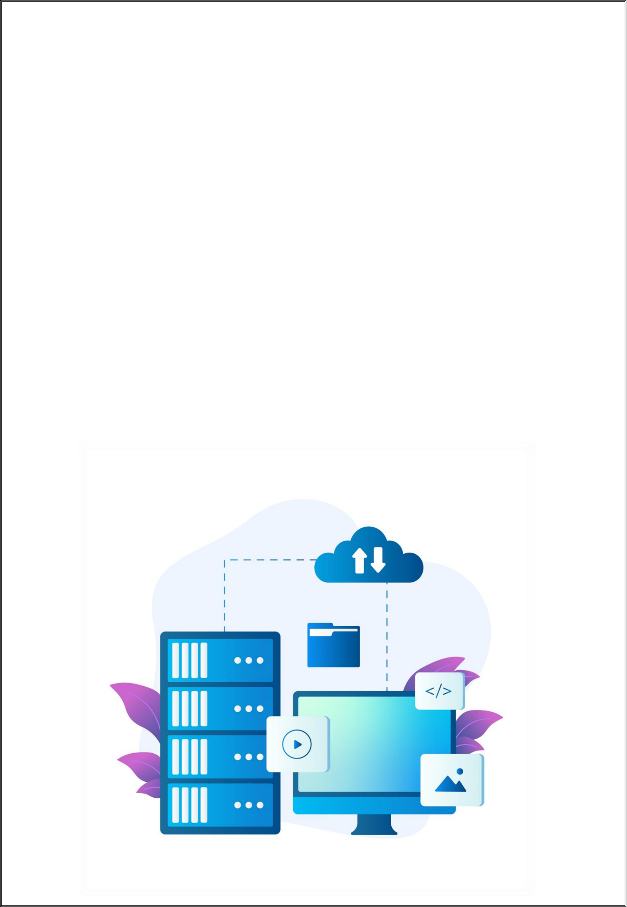
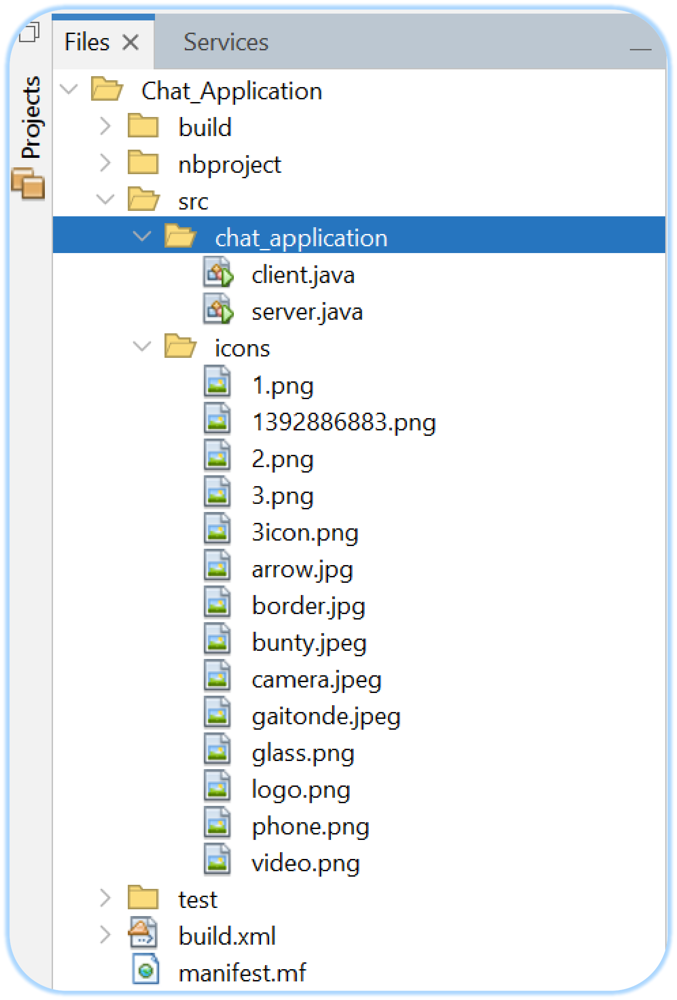
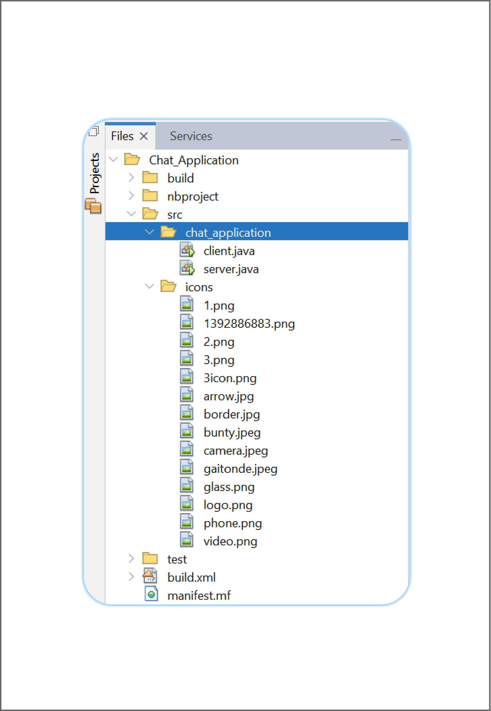

# Client_Server_Chat_Application
{width="2.488888888888889in"
height="2.488888888888889in"}{width="4.2416655730533686in"
height="2.3854571303587053in"}{width="7.611111111111111in"
height="11.027777777777779in"}

**Roll No: B-89**

**Indira College of Commerce and Science,**

**Pune.**

> **A Networking Mini Project Report On**
>
> **"CLIENT- SERVER CHAT APPLICATION USING JAVA"**

Submitted by

> **RUSHIKESH KAILAS NARAWADE**

**Seat No: 4748675**

Under the guidance of

**APARNA MAM**

> **Department of Computer Science**

{width="7.611111111111111in"
height="11.041666666666666in"}

**Roll No: B-89**

**Introduction**

This chat application project aims to provide a straightforward and
effective solution for real-time communication between two users. The
application is designed using Java Swing for the graphical user
interface (GUI) and Java socket programming for network communication.

**Key Features:**

+-----------------------------------+-----------------------------------+
| > •\                              | > **Real-Time Messaging:**        |
| > •                               | > Enables instant messaging       |
|                                   | > between users.                  |
| •                                 | >                                 |
|                                   | > **User-Friendly Interface:**    |
|                                   | > Both the client and server      |
|                                   | > applications feature intuitive  |
|                                   | > GUIs with chat areas, text      |
|                                   | > fields for message input, and   |
|                                   | > send buttons.                   |
|                                   | >                                 |
|                                   | > **Socket-Based Communication:** |
|                                   | > Utilizes TCP/IP sockets to      |
|                                   | > ensure reliable data            |
|                                   | > transmission between the client |
|                                   | > and server.                     |
+===================================+===================================+
+-----------------------------------+-----------------------------------+

**Components:**

> 1.**Client:**\
> o**GUI:** Displays the chat history, provides a text field for message
> input, and a send button to transmit messages.
>
> o**Functionality:** Connects to the server, sends user messages, and
> displays received messages.
>
> 2.**Server:**\
> o**GUI:** Similar to the client\'s GUI, used primarily to receive and
> display messages from the client.
>
> o**Functionality:** Listens for client connections, receives messages
> from the client, and can send messages back to the client.

**Technical Details:**

+-----------------------------------+-----------------------------------+
| > •\                              | > **Programming Language:** Java  |
| > •                               | > is used for both the Backend    |
|                                   | > and Frontend.                   |
|                                   | >                                 |
|                                   | > **Networking:** Communication   |
|                                   | > between the client and server   |
|                                   | > is achieved using TCP/IP        |
|                                   | > sockets, ensuring a reliable    |
|                                   | > connection.                     |
+===================================+===================================+
+-----------------------------------+-----------------------------------+

**Workflow:**

> 1.**Client Initialization:** The client application sets up its chat
> window and establishes a connection to the server.
>
> 2.**Message Sending:** Users can type messages in the text field and
> send them by clicking the send button. The message is transmitted to
> the server.
>
> 3.**Message Receiving:** Both the client and server continuously
> listen for incoming messages and update the chat display accordingly.

**Benefits:**

+-----------------------------------+-----------------------------------+
| > •\                              | > **Instant Communication:**      |
| > •                               | > Provides real-time message      |
|                                   | > exchange, improving the         |
|                                   | > efficiency of communication.    |
|                                   | >                                 |
|                                   | > **Simplicity:** The application |
|                                   | > offers a straightforward        |
|                                   | > interface and functionality,    |
|                                   | > making it easy to use.          |
+===================================+===================================+
+-----------------------------------+-----------------------------------+

{width="6.936111111111111in"
height="4.577433289588801in"}{width="7.611111111111111in"
height="11.027777777777779in"}

**Roll No: B-89**

**Networking Details**

**1. Client Code**

**Client Initialization:**

+-----------------------------------+-----------------------------------+
| > •\                              | **UI Setup:** The client sets up  |
| > •                               | a JFrame with various components  |
|                                   | including a chat area (a1), a     |
|                                   | text field                        |
|                                   |                                   |
|                                   | > (text), and a send button       |
|                                   | > (send).                         |
|                                   | >                                 |
|                                   | > **Connection:**                 |
|                                   | >                                 |
|                                   | > o The client establishes a      |
|                                   | > connection to the server using  |
|                                   | >                                 |
|                                   | > o Socket s = new                |
|                                   | > Socket(\"127.0.0.1\", 6001);.   |
|                                   | >                                 |
|                                   | > o It uses DataInputStream to    |
|                                   | > read messages from the server   |
|                                   | > and DataOutputStream to send    |
|                                   | >                                 |
|                                   | > messages to the server.         |
+===================================+===================================+
+-----------------------------------+-----------------------------------+

**Sending Messages:**

+-----------------------------------+-----------------------------------+
| > •\                              | > The actionPerformed method is   |
| > •                               | > triggered when the send button  |
|                                   | > is clicked.                     |
|                                   | >                                 |
|                                   | > It reads the text from the text |
|                                   | > field, formats it using         |
|                                   | > formatLabel(out), and sends it  |
|                                   | > to the server using             |
|                                   | > dout.writeUTF(out);.            |
+===================================+===================================+
+-----------------------------------+-----------------------------------+

**Receiving Messages:**

+-----------------------------------+-----------------------------------+
| •                                 | > In the main method, the client  |
|                                   | > continuously reads messages     |
|                                   | > from the server using           |
|                                   | > din.readUTF() and updates the   |
|                                   | > chat area accordingly.          |
+===================================+===================================+
+-----------------------------------+-----------------------------------+

{width="5.758333333333334in"
height="5.758333333333334in"}{width="7.611111111111111in"
height="11.027777777777779in"}

**Roll No: B-89**

**Networking Details 2. Server Code**

**Server Initialization:**

+-----------------------------------+-----------------------------------+
| > •\                              | > **UI Setup:** Similar to the    |
| > •                               | > client, the server sets up a    |
|                                   | > JFrame with similar components. |
|                                   | >                                 |
|                                   | > **Connection:**                 |
|                                   | >                                 |
|                                   | > o The server listens for        |
|                                   | > incoming connections on port    |
|                                   | > 6001 using                      |
|                                   | >                                 |
|                                   | > o ServerSocket skt = new        |
|                                   | > ServerSocket(6001);.            |
|                                   | >                                 |
|                                   | > o It accepts client connections |
|                                   | > using Socket s = skt.accept();. |
|                                   | >                                 |
|                                   | > o It then sets up               |
|                                   | > DataInputStream and             |
|                                   | > DataOutputStream to handle      |
|                                   | > communication.                  |
+===================================+===================================+
+-----------------------------------+-----------------------------------+

**Receiving Messages:**

> •The server reads messages from the client using din.readUTF().

**Sending Messages:**

+-----------------------------------+-----------------------------------+
| •                                 | > The server does not send        |
|                                   | > messages back to the client in  |
|                                   | > this code. However, the setup   |
|                                   | > is similar to how messages are  |
|                                   | > received.                       |
+===================================+===================================+
+-----------------------------------+-----------------------------------+

{width="5.1819444444444445in"
height="7.648050087489064in"}{width="7.611111111111111in"
height="11.027777777777779in"}

> **Project Structure**

{width="7.625in"
height="11.041666666666666in"}

**Code Details**

**Client Code Snippets:**\
1.**Establishing Connection:**\
**Sockets=newSocket(\"127.0.0.1\", 6001);**\
**DataInputStreamdin=newDataInputStream(s.getInputStream());** **dout =
newDataOutputStream(s.getOutputStream());**\
2.**Sending Messages:**

> **dout.writeUTF(out);**
>
> 3.**Receiving Messages:**\
> **Stringmsg= din.readUTF();**

**Server Code Snippets:**\
1.**Listening for Connections:**\
**ServerSocketskt=newServerSocket(6001);**\
2.**Accepting Client Connection:**\
**Sockets= skt.accept();**\
**DataInputStreamdin=newDataInputStream(s.getInputStream());** **dout =
newDataOutputStream(s.getOutputStream());**\
3.**Receiving Messages:**\
**Stringmsg= din.readUTF();**

{width="6.804166666666666in"
height="5.103125546806649in"}{width="7.625in"
height="11.027777777777779in"}

**Networking Flow**

**Client Initialization:**

> 1.**Connects to the Server:** The client initiates a connection to the
> server using a socket.
>
> 2.**Sends Messages Typed by the User:** The client captures user input
> from the text field and sends it to the server through the established
> socket connection.

**Server Initialization:**

> 1.**Listens for Incoming Connections from Clients:** The server
> creates a server socket and listens for incoming connection requests
> from clients.
>
> 2.**Accepts Connections and Reads Messages Sent by the Client:** When
> a client requests a connection, the server accepts it and establishes
> a communication channel. The server then reads messages sent by the
> client through the socket.

**Message Exchange:**

> 1.**Client Sends a Message:** The user types a message in the
> client\'s text field and clicks the send button. The message is
> transmitted to the server via the socket connection.
>
> 2.**Server Receives the Message:** The server reads the incoming
> message from the client through the socket.
>
> 3.**Processing or Displaying the Message:**
>
> o The server can process the received message (e.g., logging,
> filtering) if necessary.
>
> o The server displays the received message in its chat window.
>
> 4.**Server Sends a Response (if needed):** The server can also send
> messages back to the client. The client then reads and displays these
> messages in its chat window.

{width="6.798611111111111in"
height="6.498451443569554in"}{width="7.611111111111111in"
height="11.041666666666666in"}

**Summary**

This project is a simple chat application with a client and a server,
implemented in Java. The client and server communicate over a network
using sockets. The main purpose of this project is to enable text-based
communication between the client and server.

This project, created by Rushikesh Narawade, demonstrates basic network
communication in Java by implementing a chat application with a
client-server architecture.
